# AD-CS-PKI-Implementation-Lab

> **Lab Type:** Windows Server — Active Directory Certificate Services (AD CS) — Two-Tier PKI  
> **Author:** Luther NKAPNANG TCHATCHOUANG  
> **Role:** IT Support & Cybersecurity Analyst | Willis College, Sudbury, Ontario  
> **Course:** Willis College — Cybersecurity Analyst Diploma  
> **Assignment:** Assignment 6-1: Implementing AD CS  
> **Certification Context:** CCNA | AZ-700 (in progress) | CompTIA Security+ (planned)

---

## Table of Contents

1. [Lab Overview](#1-lab-overview)
2. [PKI Architecture](#2-pki-architecture)
3. [Environment & Virtual Machines](#3-environment--virtual-machines)
4. [Lab Objectives](#4-lab-objectives)
5. [Exercise 1 — Deploy an Offline Root CA](#5-exercise-1--deploy-an-offline-root-ca)
   - [Task 1 — Create File and Printer Sharing Exceptions](#task-1--create-file-and-printer-sharing-exceptions)
   - [Task 2 — Install and Configure AD CS on EDM-SVR2](#task-2--install-and-configure-ad-cs-on-edm-svr2)
   - [Task 3 — Create a DNS Record for the Offline Root CA](#task-3--create-a-dns-record-for-the-offline-root-ca)
6. [Exercise 2 — Deploy an Enterprise Subordinate CA](#6-exercise-2--deploy-an-enterprise-subordinate-ca)
   - [Task 1 — Install and Configure AD CS on EDM-SVR1](#task-1--install-and-configure-ad-cs-on-edm-svr1)
   - [Task 2 — Install the Subordinate CA Certificate](#task-2--install-the-subordinate-ca-certificate)
7. [Key Concepts Demonstrated](#7-key-concepts-demonstrated)
8. [Security Analysis](#8-security-analysis)
9. [Screenshots Index](#9-screenshots-index)
10. [References](#10-references)

---

## 1. Lab Overview

This laboratory demonstrates the implementation of a **two-tier Public Key Infrastructure (PKI)** using **Active Directory Certificate Services (AD CS)** in Windows Server. The deployment follows industry best practices by separating the Root CA from the Issuing CA — keeping the Root CA offline after it has signed the Subordinate CA certificate, significantly reducing the attack surface of the PKI trust anchor.

The scenario addresses Progreso Corporation's security requirements for:
- Secure HTTPS access to critical internal websites
- Certificate-based authentication for Windows and networking services
- A scalable, manageable PKI infrastructure integrated with Active Directory

---

## 2. PKI Architecture
┌─────────────────────────────────────────────────────────────────┐

│  Progreso Two-Tier PKI Hierarchy                                │

│                                                                 │

│  ┌──────────────────────────────────────────────────────────┐  │

│  │  Tier 1 — Offline Standalone Root CA                    │  │

│  │  Server:  EDM-SVR2 (192.168.0.4)                       │  │

│  │  CA Name: ProgresoRootCA                                │  │

│  │  Type:    Standalone Root CA                            │  │

│  │  Key:     RSA 4096-bit                                  │  │

│  │  Status:  OFFLINE after issuing subordinate cert        │  │

│  └─────────────────────────┬────────────────────────────────┘  │

│                            │ Signs subordinate CA certificate   │

│                            ▼                                   │

│  ┌──────────────────────────────────────────────────────────┐  │

│  │  Tier 2 — Enterprise Subordinate Issuing CA             │  │

│  │  Server:  EDM-SVR1 (192.168.0.7)                       │  │

│  │  CA Name: Progreso-IssuingCA                            │  │

│  │  Type:    Enterprise Subordinate CA                     │  │

│  │  Status:  ONLINE — issues certs to end entities         │  │

│  │  CRL/AIA: http://edm-svr1.Progreso.com/CertData/       │  │

│  └──────────────────────────────────────────────────────────┘  │

│                            │                                   │

│             Issues certificates to:                            │

│    Users | Computers | Servers | Network Devices              │

└─────────────────────────────────────────────────────────────────┘

---

## 3. Environment & Virtual Machines

| VM Name | Role | IP Address | Domain |
|---|---|---|---|
| EDM-DC1 | Primary Domain Controller / DNS | 192.168.0.2 | Progreso.com |
| EDM-SVR1 | Enterprise Subordinate CA / IIS / CRL Host | 192.168.0.7 | Progreso.com |
| EDM-SVR2 | Offline Standalone Root CA | 192.168.0.4 | Standalone (not domain-joined) |
| EDM-Router | Inter-network routing | 192.168.0.1 | — |

- **Hypervisor:** Microsoft Hyper-V
- **Operating System:** Windows Server 2025
- **Domain:** Progreso.com

---

## 4. Lab Objectives

After completing this lab, the following competencies are demonstrated:

- Deploying a two-tier PKI hierarchy using AD CS
- Configuring a Standalone Root CA with a 4096-bit RSA key
- Configuring CDP and AIA extensions for certificate revocation
- Publishing Certificate Revocation Lists (CRLs)
- Exporting and transferring CA certificates between servers
- Deploying an Enterprise Subordinate CA integrated with AD DS
- Installing CA Web Enrollment on the Subordinate CA
- Submitting, approving, and installing a subordinate CA certificate
- Taking the Root CA offline after PKI establishment
- Creating DNS records to support PKI infrastructure

---

## 5. Exercise 1 — Deploy an Offline Root CA

---

### Task 1 — Create File and Printer Sharing Exceptions

**Performed on: EDM-SVR2**

File and Printer Sharing was enabled on EDM-SVR2 to allow the subordinate CA on EDM-SVR1 to access the C$ administrative share for certificate and CRL file transfers.

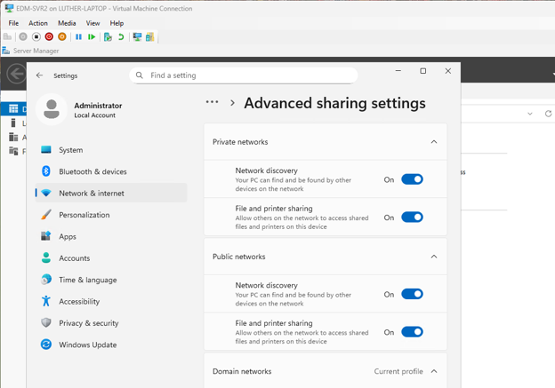

---

### Task 2 — Install and Configure AD CS on EDM-SVR2

**Performed on: EDM-SVR2 (Local Administrator)**

#### Step 1 — Install the AD CS Role

The Active Directory Certificate Services role was installed on EDM-SVR2 with the Certification Authority role service selected.

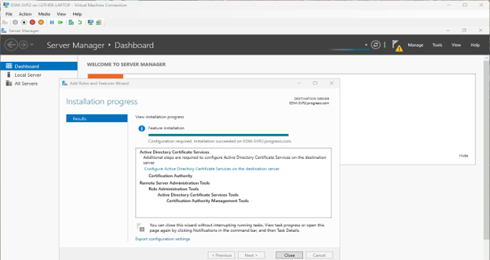

---

#### Step 2 — Configure the Root CA

The Root CA was configured with the following settings:

| Setting | Value |
|---|---|
| CA Type | Standalone CA |
| CA Role | Root CA |
| Private Key | Create new private key |
| Key Length | **4096 bits** (enhanced security) |
| Hash Algorithm | SHA-256 (default) |
| Common Name | **ProgresoRootCA** |

```powershell
# Verify Root CA configuration after installation
certutil -cainfo
certutil -getreg CA\CACertHash
```

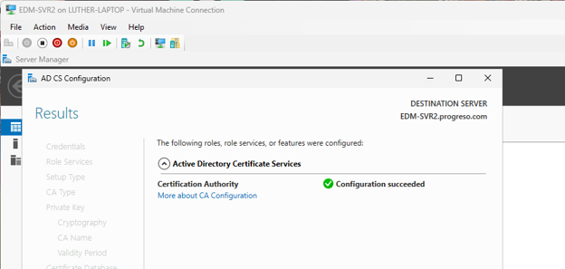

---

#### Step 3 — Configure CDP Extension

The CRL Distribution Point (CDP) extension was configured to point to the EDM-SVR1 web server, enabling clients to download the Certificate Revocation List and verify certificate validity.

**CDP URL configured:**
http://edm-svr1.Progreso.com/CertData/<CaName><CRLNameSuffix><DeltaCRLAllowed>.crl

Options enabled:
- ✅ Include in the CDP extension of issued certificates
- ✅ Include in CRLs — Clients use this to find Delta CRL locations

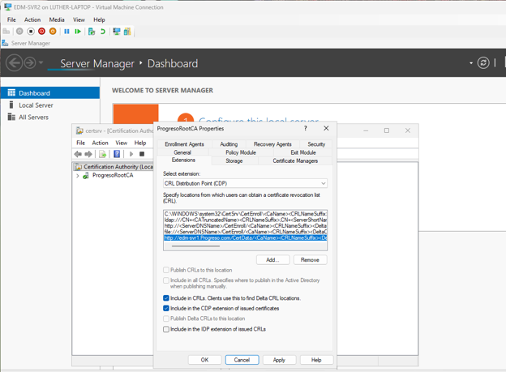

---

#### Step 4 — Configure AIA Extension

The Authority Information Access (AIA) extension was configured to allow clients to locate and download the Root CA certificate for chain building.

**AIA URL configured:**
http://edm-svr1.Progreso.com/CertData/<ServerDNSName>_<CaName><CertificateName>.crt

Option enabled:
- ✅ Include in the AIA extension of issued certificates

```powershell
# Verify CDP and AIA extensions on the Root CA
certutil -getreg CA\CRLPublicationURLs
certutil -getreg CA\CACertPublicationURLs
```

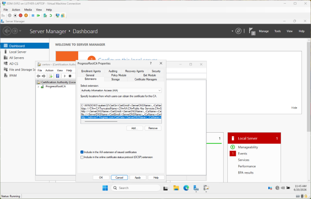

---

#### Step 5 — Publish the CRL

The Certificate Revocation List was published manually after configuring the CDP extension. The CA service was restarted to apply the CDP and AIA configuration changes.

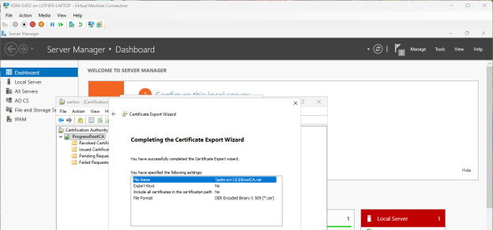

---

#### Step 6 — Export Root CA Certificate and Copy CertEnroll Files

The Root CA certificate was exported in DER format and saved directly to the EDM-SVR1 C$ share. The CertEnroll folder contents (CRL and CRT files) were also copied to EDM-SVR1.
Files transferred to EDM-SVR1:

\edm-svr1\C$\RootCA.cer                    — Root CA certificate (DER format)

\edm-svr1\C$\ProgresoRootCA.crl            — Certificate Revocation List

\edm-svr1\C$\EDM-SVR2_ProgresoRootCA.crt   — Root CA certificate (CRT format)

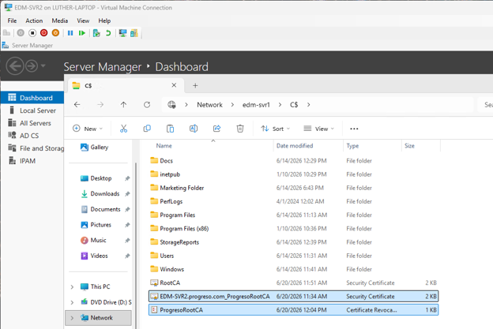

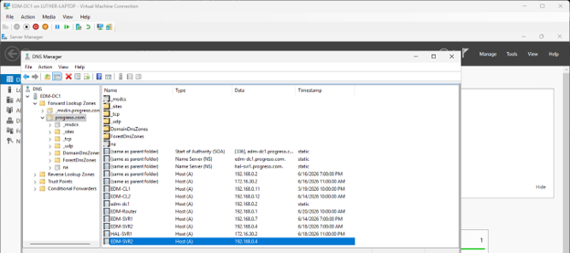

---

### Task 3 — Create a DNS Record for the Offline Root CA

**Performed on: EDM-DC1**

A DNS Host (A) record was created for EDM-SVR2 in the Progreso.com forward lookup zone, enabling other servers to resolve the Root CA hostname even when the server is offline.

| DNS Record | Type | IP Address |
|---|---|---|
| EDM-SVR2.Progreso.com | Host (A) | 192.168.0.4 |

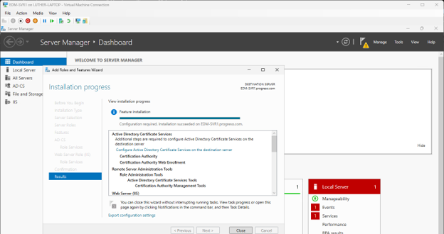

---

## 6. Exercise 2 — Deploy an Enterprise Subordinate CA

---

### Task 1 — Install and Configure AD CS on EDM-SVR1

**Performed on: EDM-SVR1**

#### Step 1 — Install the AD CS Role with Web Enrollment

The AD CS role was installed on EDM-SVR1 with two role services:
- **Certification Authority** — core CA functionality
- **Certification Authority Web Enrollment** — enables web-based certificate requests

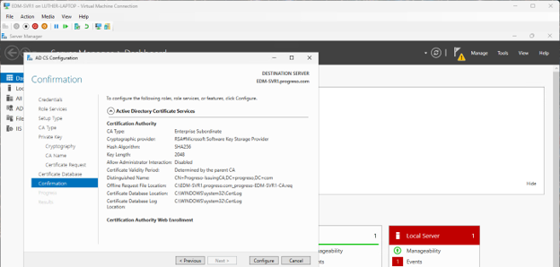

---

#### Step 2 — Configure the Subordinate CA

The Subordinate CA was configured with the following settings:

| Setting | Value |
|---|---|
| CA Type | Enterprise CA |
| CA Role | Subordinate CA |
| Private Key | Create new private key |
| Common Name | **Progreso-IssuingCA** |
| Certificate Request | Saved to file on target machine |

> **Note:** The CA service remains stopped until the subordinate CA certificate is issued and installed by the Root CA. This is expected behavior.

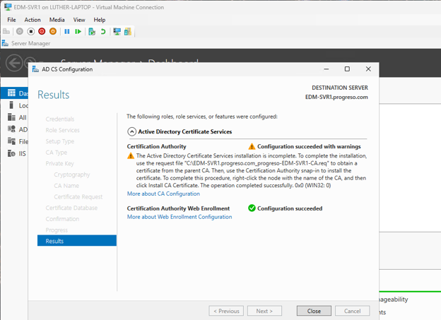

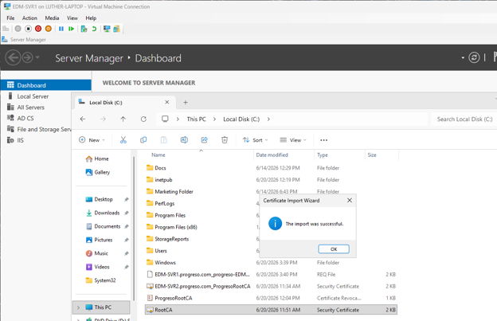

---

### Task 2 — Install the Subordinate CA Certificate

#### Step 1 — Install Root CA Certificate in Trusted Root Store

The RootCA.cer file was imported into the Local Machine Trusted Root Certification Authorities store on EDM-SVR1, establishing trust for the Root CA on the Subordinate CA server.

```powershell
# Import Root CA certificate via PowerShell
Import-Certificate -FilePath "C:\RootCA.cer" `
    -CertStoreLocation "Cert:\LocalMachine\Root"

# Verify the certificate was imported
Get-ChildItem Cert:\LocalMachine\Root |
    Where-Object {$_.Subject -like "*ProgresoRootCA*"}
```

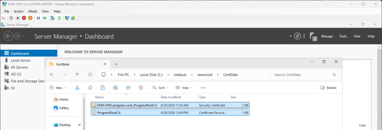

---

#### Step 2 — Copy CRL and CRT Files to CertData Web Folder

The ProgresoRootCA.crl and EDM-SVR2_ProgresoRootCA.crt files were copied into the IIS CertData virtual directory on EDM-SVR1, enabling clients to download revocation information via the CDP URL.
C:\inetpub\wwwroot\CertData

├── ProgresoRootCA.crl

└── EDM-SVR2_ProgresoRootCA.crt

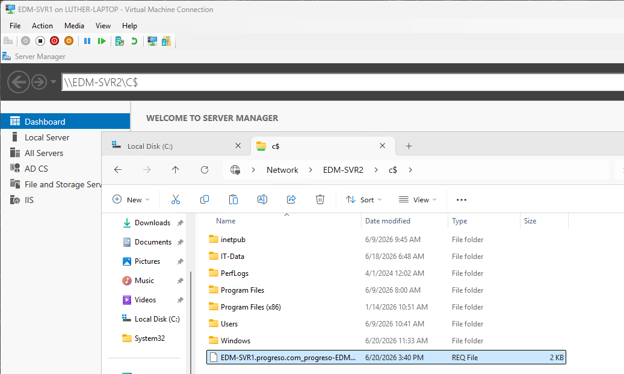

---

#### Step 3 — Copy Certificate Request to EDM-SVR2

The subordinate CA certificate request (.req file) was copied from EDM-SVR1 to the EDM-SVR2 C$ share for submission to the Root CA.

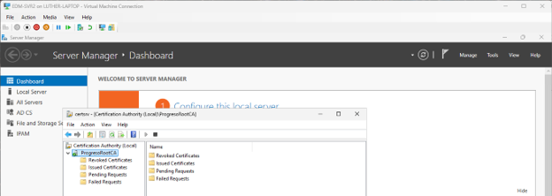

---

#### Step 4 — Submit Certificate Request on EDM-SVR2

The certificate request was submitted to the ProgresoRootCA using the Submit New Request function in the Certification Authority console.

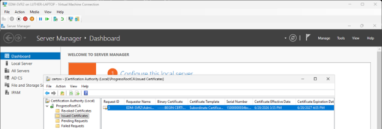

---

#### Step 5 — Approve and Issue the Subordinate CA Certificate

The pending certificate request was located in the Pending Requests container, refreshed, and issued. The issued certificate appeared in the Issued Certificates container.

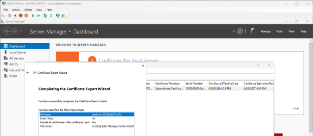

---

#### Step 6 — Export the Issued Certificate

The issued subordinate CA certificate was exported in PKCS #7 format (.P7B) with the full certificate chain included.

| Export Setting | Value |
|---|---|
| Format | PKCS #7 (.P7B) |
| Include chain | ✅ Yes — all certificates in path |
| Destination | \\edm-svr1\C$\SubCA.p7b |

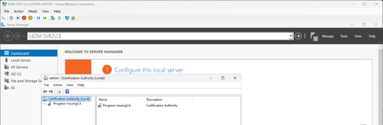

---

#### Step 7 — Install the Subordinate CA Certificate on EDM-SVR1

The SubCA.p7b file was installed via the Certification Authority console. The CA service was then started successfully, completing the PKI deployment.

```powershell
# Verify the Subordinate CA is running
Get-Service CertSvc | Select-Object Name, Status

# Verify the CA certificate chain
certutil -verify -urlfetch C:\SubCA.p7b

# Check the CA configuration
certutil -cainfo
```

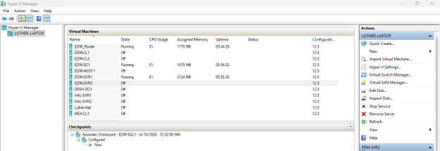

---

#### Step 8 — Shut Down EDM-SVR2 (Root CA Goes Offline)

EDM-SVR2 was shut down after the subordinate CA certificate was successfully installed and the Progreso-IssuingCA service was confirmed running. The Root CA is now offline — a critical security best practice.


---

## 7. Key Concepts Demonstrated

### Two-Tier PKI Design Principles

| Principle | Implementation |
|---|---|
| **Root CA isolation** | EDM-SVR2 (Standalone, not domain-joined) taken offline after signing subordinate cert |
| **Separation of duties** | Root CA signs only CA certificates — Issuing CA signs end-entity certificates |
| **Trust anchor protection** | Root CA private key never exposed to network after initial setup |
| **Scalability** | Additional Issuing CAs can be added under the same Root CA |
| **AD DS integration** | Enterprise CA leverages AD for autoenrollment and template management |

### CDP and AIA — Why They Matter
Certificate Validation Flow (Client Perspective)
Client receives certificate from server

│

▼

Client reads CDP extension → downloads CRL from:

http://edm-svr1.Progreso.com/CertData/ProgresoRootCA.crl

│

├─► Certificate NOT in CRL → Valid ✅

└─► Certificate IN CRL     → Revoked ❌
Client reads AIA extension → downloads issuer certificate from:

http://edm-svr1.Progreso.com/CertData/EDM-SVR2_ProgresoRootCA.crt

│

▼

Client builds and validates the full certificate chain:

ProgresoRootCA → Progreso-IssuingCA → End Entity Certificate

### Certificate File Formats Used

| Format | Extension | Use Case |
|---|---|---|
| DER encoded binary | .cer / .crt | Single certificate — Root CA export |
| PKCS #7 | .p7b | Certificate chain — Subordinate CA install |
| Certificate Revocation List | .crl | Published list of revoked certificates |
| Certificate Request | .req | Certificate Signing Request (CSR) |

---

## 8. Security Analysis

| Security Control | Implementation | Security Benefit |
|---|---|---|
| **Offline Root CA** | EDM-SVR2 shut down after PKI setup | Root CA private key never network-accessible |
| **Standalone Root CA** | Not domain-joined | Cannot be compromised via AD attacks |
| **4096-bit RSA key** | Set during Root CA configuration | Stronger than default 2048-bit — future-proof |
| **Two-tier hierarchy** | Root → Subordinate separation | Compromise of Issuing CA does not compromise Root |
| **CDP publication** | CRL hosted on IIS (EDM-SVR1) | Clients can verify certificate revocation status |
| **AIA publication** | CA cert hosted on IIS (EDM-SVR1) | Clients can build and validate certificate chains |
| **DNS record for offline CA** | A record on EDM-DC1 | CDP/AIA URLs resolve even when Root CA is offline |

> **Critical Security Note:** The Root CA (EDM-SVR2) should be powered on only when absolutely necessary — specifically when issuing or renewing subordinate CA certificates. In production environments, physical access controls and a documented power-on procedure are required.

---

## 9. Screenshots Index

| File | Exercise | Task | Description |
|---|---|---|---|
| Image1.png | Ex1 | Task 1 | File and printer sharing enabled on EDM-SVR2 |
| Image2.png | Ex1 | Task 2 Step 1 | AD CS role installation on EDM-SVR2 |
| Image3.png | Ex1 | Task 2 Step 2 | Root CA configured — ProgresoRootCA |
| Image4.png | Ex1 | Task 2 Step 3 | CDP extension configured |
| Image5.png | Ex1 | Task 2 Step 4 | AIA extension configured |
| Image6.png | Ex1 | Task 2 Step 5 | CRL published — CA service restarted |
| Image7.png | Ex1 | Task 2 Step 6 | Root CA certificate exported |
| Image8.png | Ex1 | Task 2 Step 7 | CertEnroll files copied to EDM-SVR1 |
| Image9.png | Ex1 | Task 3 | DNS A record — EDM-SVR2 → 192.168.0.4 |
| Image10.png | Ex2 | Task 1 Step 1 | AD CS with CA Web Enrollment on EDM-SVR1 |
| Image11.png | Ex2 | Task 1 Step 2 | Subordinate CA configured — Progreso-IssuingCA |
| Image12.png | Ex2 | Task 1 Step 2 | Certificate request file saved |
| Image13.png | Ex2 | Task 2 Step 1 | RootCA.cer installed in Trusted Root store |
| Image14.png | Ex2 | Task 2 Step 2 | CRL and CRT files in CertData web folder |
| Image15.png | Ex2 | Task 2 Step 3 | REQ file copied to EDM-SVR2 |
| Image16.png | Ex2 | Task 2 Step 4 | Certificate request submitted to Root CA |
| Image17.png | Ex2 | Task 2 Step 5 | Subordinate CA certificate issued |
| Image18.png | Ex2 | Task 2 Step 6 | SubCA.p7b exported to EDM-SVR1 |
| Image19.png | Ex2 | Task 2 Step 7 | Progreso-IssuingCA service started |
| Image20.png | Ex2 | Task 2 Step 8 | EDM-SVR2 shut down — Root CA offline |

---

## 10. References

- [Microsoft Docs — AD CS Overview](https://learn.microsoft.com/en-us/windows-server/identity/ad-cs/active-directory-certificate-services-overview)
- [Microsoft Docs — Deploy a Two-Tier PKI Hierarchy](https://learn.microsoft.com/en-us/windows-server/networking/core-network-guide/cncg/server-certs/deploy-server-certificates-for-802.1x-wired-and-wireless-deployments)
- [Microsoft Docs — Configure CDP and AIA Extensions](https://learn.microsoft.com/en-us/windows-server/networking/core-network-guide/cncg/server-certs/configure-the-cdp-and-aia-extensions-on-ca1)
- [Microsoft Docs — Certificate Revocation](https://learn.microsoft.com/en-us/windows-server/identity/ad-cs/certificate-revocation-list-distribution)
- [NIST SP 800-57 — Key Management Guidelines](https://csrc.nist.gov/publications/detail/sp/800-57-part-1/rev-5/final)

---

*This lab is part of a portfolio of IT infrastructure and cybersecurity labs developed during the Cybersecurity Analyst Diploma program at Willis College, Sudbury, Ontario.*
